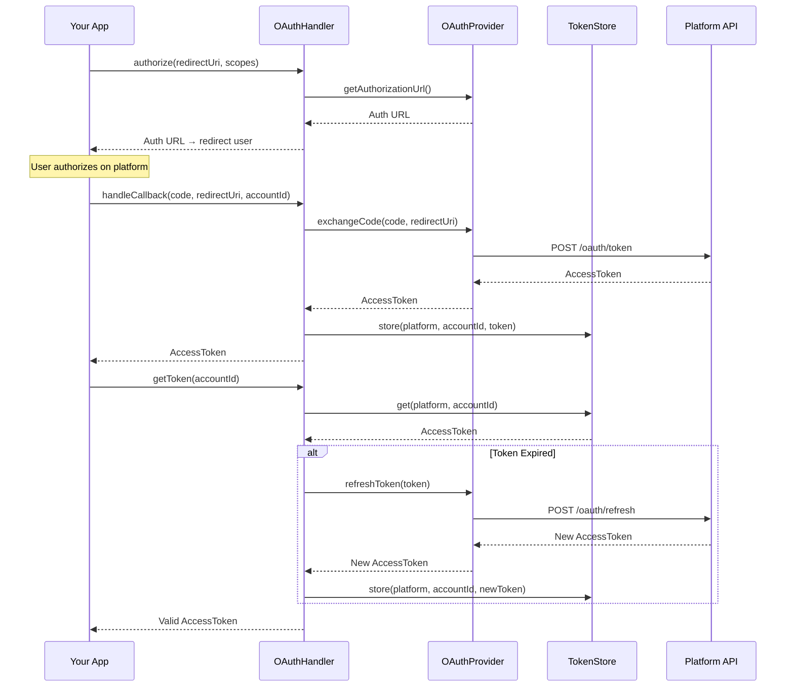

# OAuth Flow

The auth layer provides contracts for OAuth flows. Framework packages supply concrete implementations for token storage.

## OAuthHandler

```php
use Owlstack\Core\Auth\OAuthHandler;

$handler = new OAuthHandler($provider, $tokenStore, 'twitter');

// Step 1: Generate authorization URL
$authUrl = $handler->authorize('https://app.com/callback', ['tweet.read', 'tweet.write']);
// Redirect user to $authUrl

// Step 2: Handle callback after user authorizes
$token = $handler->handleCallback($code, 'https://app.com/callback', 'user-123');

// Step 3: Get valid token (auto-refreshes if expired)
$token = $handler->getToken('user-123');
```

## Flow diagram



The `OAuthHandler` requires two interface implementations:

- **`OAuthProviderInterface`** — Generates auth URLs, exchanges codes, refreshes tokens
- **`TokenStoreInterface`** — Persists and retrieves access tokens
