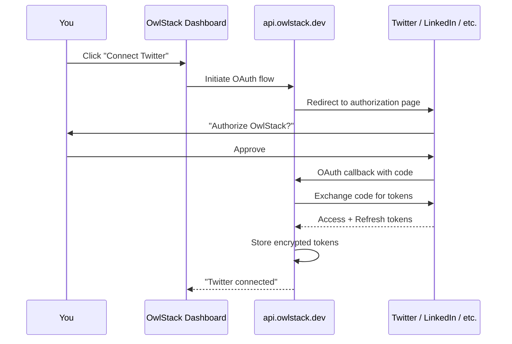

# OAuth Flow

OwlStack manages OAuth authentication for all platforms on the server side. You connect platforms through the dashboard, and OwlStack handles token exchange, storage, and refresh automatically.

## How it works



## What OwlStack handles

- **Token exchange** -- converting authorization codes to access tokens
- **Secure storage** -- tokens are encrypted at rest
- **Automatic refresh** -- tokens are refreshed before they expire
- **Scope management** -- requesting the right permissions for each platform

## You never touch tokens

In the SaaS model, your code only needs an OwlStack API key:

```php
$client = new OwlStackClient(apiKey: env('OWLSTACK_API_KEY'));
$client->publish($post, [Platform::Twitter]);
// OwlStack uses the stored OAuth tokens automatically
```

See [API Keys](./api-keys.md) for managing your OwlStack API key, and [Platform Credentials](./platform-credentials.md) for the pass-per-request alternative.
