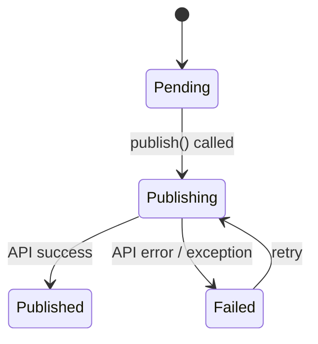

# Delivery Status

A PHP 8.1 backed enum for tracking the delivery lifecycle in your storage layer.

```php
use Owlstack\Core\Delivery\DeliveryStatus;

$status = DeliveryStatus::Pending;     // 'pending'
$status = DeliveryStatus::Publishing;  // 'publishing'
$status = DeliveryStatus::Published;   // 'published'
$status = DeliveryStatus::Failed;      // 'failed'
```

## State machine



## Usage example

```php
// Store initial state
$delivery = new DeliveryRecord(
    platform: 'twitter',
    status: DeliveryStatus::Pending,
);

// Update on publish
$delivery->status = DeliveryStatus::Publishing;

// Update on result
$delivery->status = $result->success
    ? DeliveryStatus::Published
    : DeliveryStatus::Failed;
```

:::tip Pro Feature
**OwlStack Pro** includes `DeliveryLogStore` with full attempt history, retry strategies, and persistence. See [Delivery Logging](../pro/delivery-logging.md).
:::
