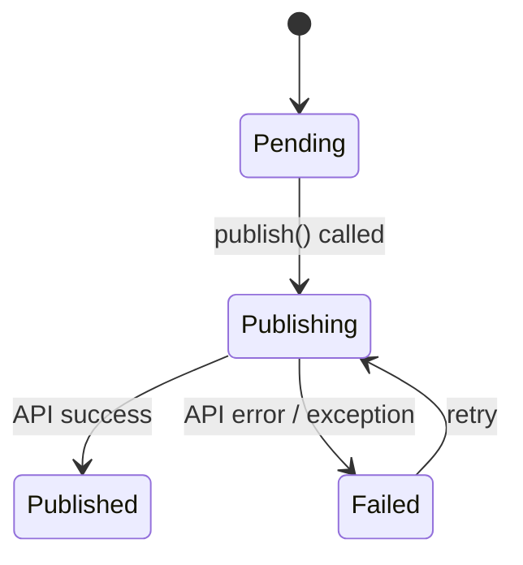

# Delivery Status

A PHP 8.1 backed enum for tracking the delivery lifecycle.

```php
use OwlStack\Enums\DeliveryStatus;

$status = DeliveryStatus::Pending;     // 'pending'
$status = DeliveryStatus::Publishing;  // 'publishing'
$status = DeliveryStatus::Published;   // 'published'
$status = DeliveryStatus::Failed;      // 'failed'
```

## State machine



## Usage in your application

The `DeliveryStatus` enum helps you track publishing state in your own database:

```php
// Store initial state
$delivery = new DeliveryRecord(
    platform: 'twitter',
    status: DeliveryStatus::Pending,
);

// Update on result
$delivery->status = $result->isSuccessful()
    ? DeliveryStatus::Published
    : DeliveryStatus::Failed;
```

## Cloud-side tracking

OwlStack also tracks delivery status on the server. With the **Pro plan**, you get full delivery logging with attempt history, retry details, and analytics. See [Delivery Logging](../pro/delivery-logging.mdx).
