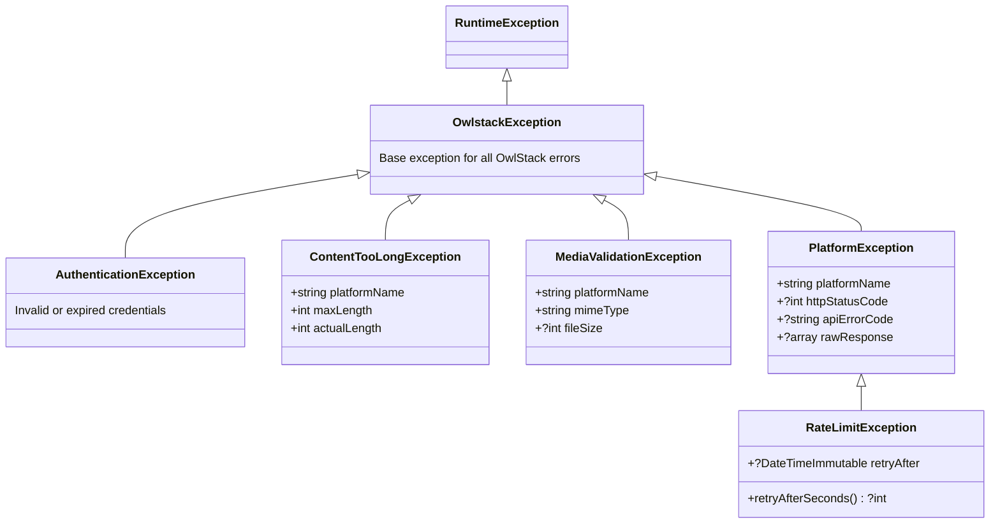

# Error Handling

OwlStack uses a structured exception hierarchy. The `Publisher` catches all exceptions internally (returning `PublishResult` with errors), but you can handle them directly when using platform classes.

## Exception hierarchy



## Catching specific exceptions

```php
use Owlstack\Core\Exceptions\RateLimitException;
use Owlstack\Core\Exceptions\ContentTooLongException;
use Owlstack\Core\Exceptions\MediaValidationException;
use Owlstack\Core\Exceptions\AuthenticationException;

try {
    $response = $platform->publish($post);
} catch (RateLimitException $e) {
    $seconds = $e->retryAfterSeconds();
    echo "Rate limited. Retry after {$seconds} seconds.";
    sleep($seconds ?? 60);
    // retry...
} catch (ContentTooLongException $e) {
    echo "Content is {$e->actualLength} chars, max is {$e->maxLength} for {$e->platformName}";
} catch (MediaValidationException $e) {
    echo "Invalid media: {$e->mimeType} not supported on {$e->platformName}";
} catch (AuthenticationException $e) {
    echo "Auth failed — check your credentials";
}
```

## Publisher vs Platform

| Approach | Throws? | Returns |
|:---------|:--------|:--------|
| `$publisher->publish()` | **Never** | `PublishResult` with `->success` / `->error` |
| `$platform->publish()` | **Yes** | `PlatformResponseInterface` or throws |

Use `Publisher` for production code (exception-safe). Use platform classes directly when you need fine-grained exception handling.
