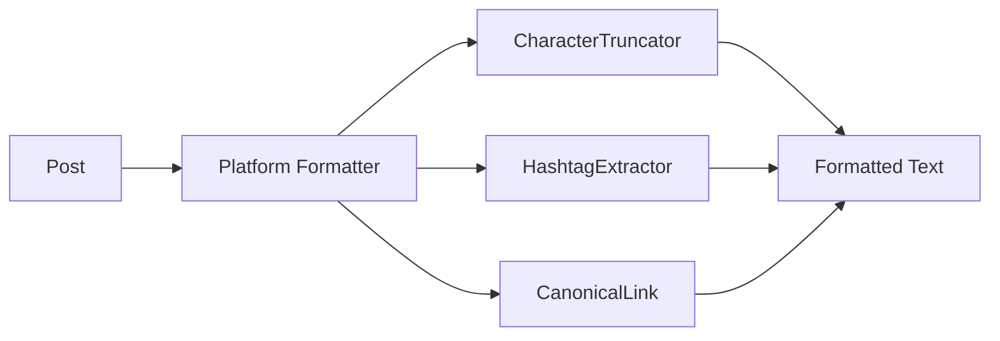

# Platform Formatters

Each platform has a dedicated formatter that implements `FormatterInterface`. Formatters handle character limits, markup syntax, hashtag injection, and URL formatting automatically.

## How it works



When you call `$publisher->publish($post, 'telegram')`, the Telegram formatter:

1. Takes the post body
2. Converts markup to HTML (Telegram's format)
3. Injects hashtags from `$post->tags` within the character budget
4. Appends the canonical URL if there's room
5. Truncates to 4,096 characters at a word boundary

## FormatterInterface

```php
use Owlstack\Core\Formatting\Contracts\FormatterInterface;

$formatter->format($post, $options);  // Formatted string
$formatter->platform();               // 'telegram'
$formatter->maxLength();              // 4096
```

## Markup by platform

| Platform | Markup Format |
|:---------|:-------------|
| Telegram | HTML |
| Twitter/X | Plain text |
| Facebook | Plain text |
| LinkedIn | Plain text |
| Discord | Markdown |
| Instagram | Plain text |
| Pinterest | Plain text |
| Reddit | Markdown |
| Slack | mrkdwn |
| Tumblr | NPF (Neue Post Format) |
| WhatsApp | Plain text |
