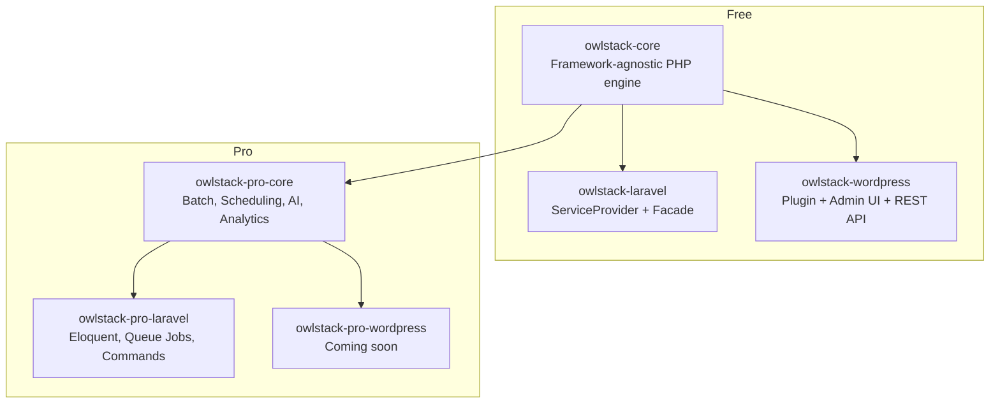
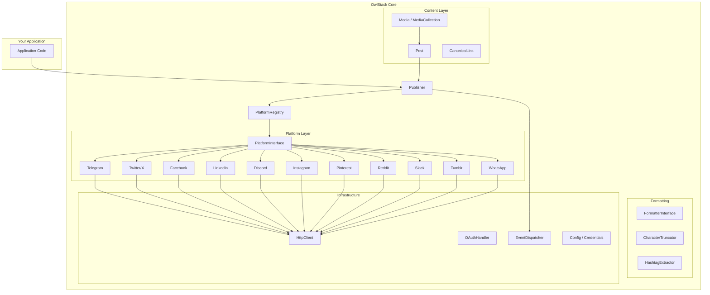
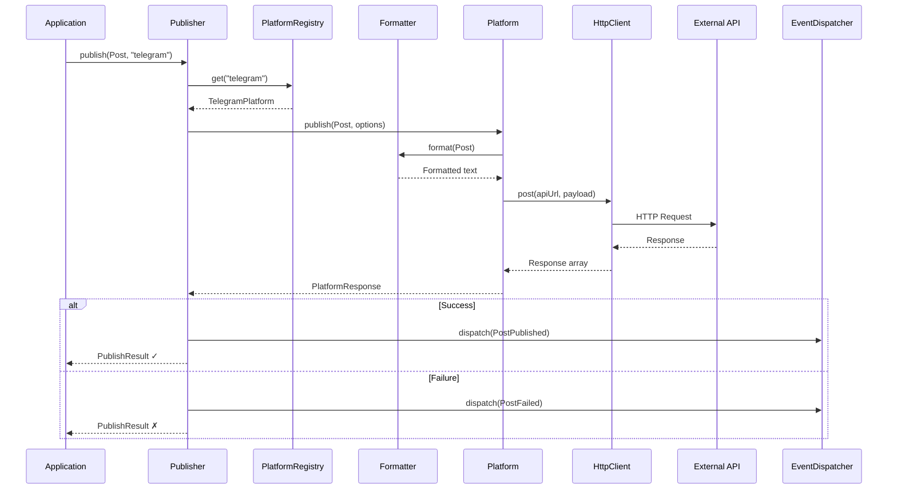

# Architecture Overview

OwlStack is built on a **contract-driven, layered architecture** with zero framework dependencies. Framework packages (Laravel, WordPress) provide concrete implementations for storage, queues, and events.

## Package hierarchy



## Core architecture



## Publishing flow



## Key design principles

### Contract-driven

Every infrastructure concern is defined as an interface:

- `PlatformInterface` — Platform publishing contract
- `FormatterInterface` — Content formatting contract
- `HttpClientInterface` — HTTP communication contract
- `EventDispatcherInterface` — Event dispatch contract
- `TokenStoreInterface` — Token persistence contract
- `OAuthProviderInterface` — OAuth flow contract

This means you can swap any implementation — use Guzzle instead of cURL, Redis instead of database for tokens, or any custom event system.

### Immutable value objects

All data objects are readonly:

```php
$post = new Post(title: 'Hello', body: 'World');
// $post->title = 'Changed'; // ❌ Cannot modify readonly property
```

This eliminates bugs from accidental mutation during the publishing pipeline.

### Exception-safe publishing

The `Publisher` wraps all platform calls in try/catch and always returns a `PublishResult`:

```php
$result = $publisher->publish($post, 'twitter');
// Never throws — always check $result->success
```

Individual platform classes **do** throw typed exceptions (`RateLimitException`, `ContentTooLongException`, etc.) for direct usage.

### Source directory structure

| Directory | Purpose |
|:----------|:--------|
| `Auth/` | OAuth handler, access tokens, token store contracts |
| `Config/` | `PlatformCredentials`, `OwlstackConfig`, `ConfigValidator` |
| `Content/` | `Post`, `Media`, `MediaCollection`, `CanonicalLink` |
| `Delivery/` | `DeliveryStatus` enum |
| `Events/` | `EventDispatcherInterface`, `PostPublished`, `PostFailed` |
| `Exceptions/` | `OwlstackException` hierarchy |
| `Formatting/` | Per-platform formatters, `CharacterTruncator`, `HashtagExtractor` |
| `Http/` | cURL `HttpClient`, `HttpClientInterface` |
| `Platforms/` | 11 platform implementations + `PlatformRegistry` + contracts |
| `Publishing/` | `Publisher`, `PublishResult` |
| `Support/` | `Arr`, `Str`, `Clock` utilities |
