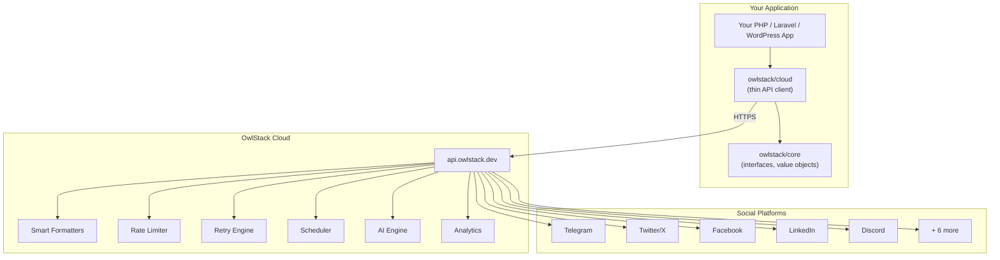
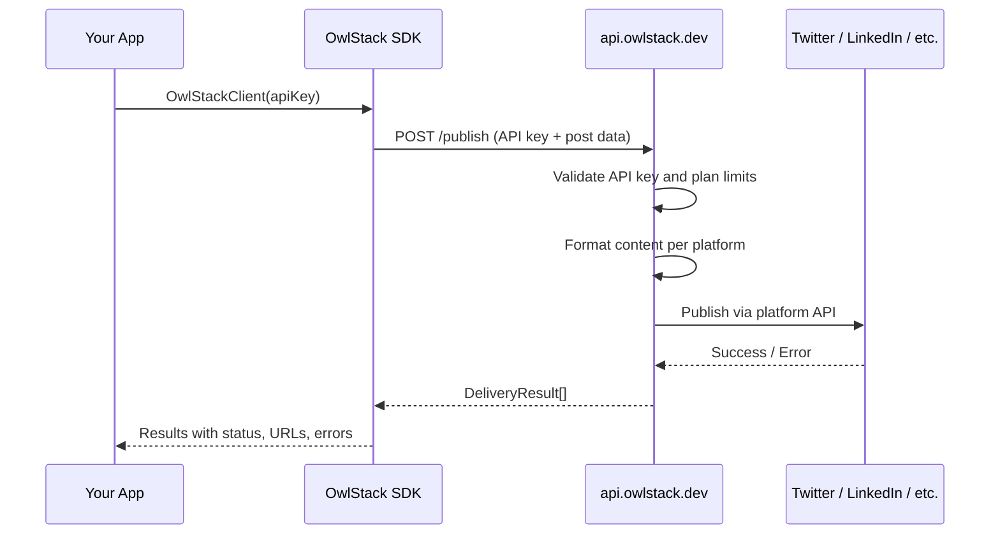

# Architecture

OwlStack follows a **SaaS-first architecture** with open-source SDKs. Your application talks to OwlStack's cloud API, which handles all platform communication.

## Overview



## What runs where

### In your application (SDK side)

The SDK packages are **thin clients** with no platform logic:

| Component | Description |
|:----------|:------------|
| `Post` | Immutable value object for content |
| `Media` | Immutable value object for attachments |
| `Platform` | Enum of supported platforms |
| `DeliveryResult` | Result object returned after publishing |
| `OwlStackClient` | HTTP client that calls `api.owlstack.dev` |
| Events | `PostPublished`, `PostFailed` fired locally |

### On OwlStack's cloud (api.owlstack.dev)

All business logic runs on our servers:

| Component | Description |
|:----------|:------------|
| Platform integrations | All 11 platform API implementations |
| Smart formatters | Character limits, hashtags, markup per platform |
| OAuth management | Token storage, automatic refresh |
| Rate limiting | Per-platform throttling |
| Retry engine | Exponential backoff, circuit breaker |
| Media processing | Resize, optimize, format conversion |
| Scheduling | Delayed and recurring publishing |
| AI engine | Content generation, optimization, hashtags |
| Analytics | Tracking, insights, reports |

## Publishing flow



## Packages

| Package | Purpose | License |
|:--------|:--------|:--------|
| `owlstack/core` | Interfaces, value objects, enums | MIT |
| `owlstack/cloud` | API client for `api.owlstack.dev` | Proprietary |
| `owlstack/laravel` | Laravel service provider + facade | MIT |
| `owlstack/wordpress` | WordPress plugin with admin UI | MIT |

## Platform credentials

You have two options for managing platform credentials:

### Option A: Managed OAuth (recommended)

Connect platforms through the [OwlStack dashboard](https://app.owlstack.dev). We store and refresh tokens automatically. You never handle platform API keys in your code.

### Option B: Pass-per-request

Send your own platform credentials with each API call. OwlStack uses them for that request only and never stores them.

```php
// Option A -- tokens managed by OwlStack
$client->publish($post, [Platform::Twitter]);

// Option B -- you pass credentials per request
$client->publish($post, [
    Platform::Twitter->withCredentials([
        'api_key' => env('TWITTER_API_KEY'),
        'api_secret' => env('TWITTER_API_SECRET'),
        'access_token' => env('TWITTER_ACCESS_TOKEN'),
        'access_secret' => env('TWITTER_ACCESS_SECRET'),
    ]),
]);
```

## Key design principles

### Immutable value objects

All data objects are readonly:

```php
$post = Post::create('Hello world');
// $post->body = 'Changed'; // Cannot modify readonly property
```

### Exception-safe publishing

The client wraps all API calls and always returns a `DeliveryResult`:

```php
$result = $client->publish($post, [Platform::Twitter]);
// Never throws -- always check $result->isSuccessful()
```

### Open interfaces, cloud implementation

`owlstack/core` defines contracts like `PublisherInterface`, `FormatterInterface`, and `EventDispatcherInterface`. The cloud service implements all of them server-side. Your code depends only on the open-source interfaces.
