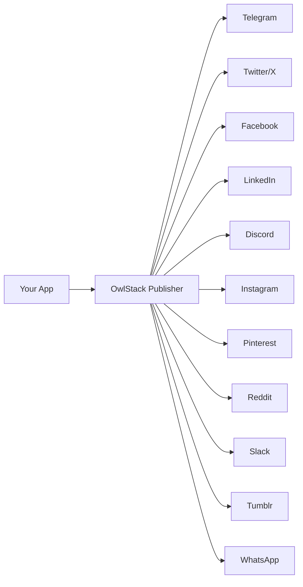

# What is OwlStack?

**OwlStack** is a unified social media publishing SDK that lets you publish content to **11 social media platforms** through a single, consistent PHP API.

Instead of learning 11 different APIs, SDKs, and authentication flows, you write one piece of code and OwlStack handles the rest — formatting, character limits, media constraints, and platform quirks.

## Who is it for?

- **PHP developers** building applications that need to publish to social media
- **Laravel developers** who want a clean, integrated publishing experience
- **WordPress site owners** who want to auto-publish posts to social channels
- **Agencies** managing multi-platform social media for clients
- **SaaS builders** adding social publishing to their products

## How it works



You create a `Post` object with your content, choose a platform, and call `publish()`. OwlStack:

1. **Formats** your content for the target platform (character limits, markup syntax, hashtags)
2. **Validates** media against platform constraints (file types, sizes, dimensions)
3. **Authenticates** with the platform API using your credentials
4. **Publishes** the content and returns a result with the external ID and URL
5. **Dispatches events** so you can react to success or failure

## Packages

| Package | Purpose | Framework |
|:--------|:--------|:----------|
| `owlstack/owlstack-core` | Core engine — all platforms, formatting, HTTP, auth | None (standalone PHP) |
| `owlstack/owlstack-laravel` | Laravel integration — service provider, facade, config | Laravel 10/11/12 |
| `owlstack/owlstack-wordpress` | WordPress plugin — admin UI, meta boxes, REST API | WordPress 6.4+ |
| `owlstack/owlstack-pro-core` | Pro features — batch, scheduling, AI, analytics | None (standalone PHP) |
| `owlstack/owlstack-pro-laravel` | Pro Laravel — queue jobs, Eloquent models, commands | Laravel 10/11/12 |

## Quick example

```php
use Owlstack\Core\Content\Post;
use Owlstack\Core\Publishing\Publisher;

$post = new Post(
    title: 'Hello World',
    body: 'My first post via OwlStack!',
    url: 'https://example.com/hello-world',
    tags: ['opensource', 'php'],
);

$result = $publisher->publish($post, 'telegram');

if ($result->success) {
    echo "Published! URL: {$result->externalUrl}";
}
```

That's it. The same code structure works for all 11 platforms.
