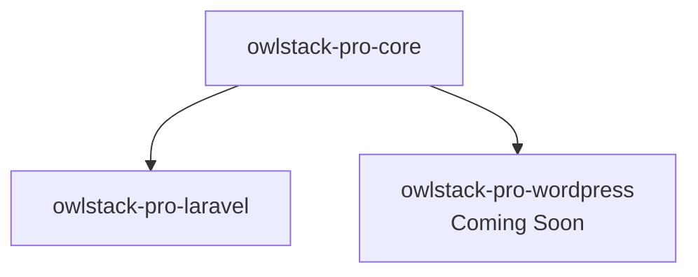

import ProBadge from '@site/src/components/ProBadge';
import ProFeature from '@site/src/components/ProFeature';

# Pro Features <ProBadge />

OwlStack Pro extends the core with premium features for production-grade social media automation.

<ProFeature>

All features below require `owlstack/owlstack-pro-core` or `owlstack/owlstack-pro-laravel`.

</ProFeature>

## Installation

```bash
# Standalone PHP
composer require owlstack/owlstack-pro-core

# Laravel
composer require owlstack/owlstack-pro-laravel
```

## Feature comparison

| Feature | Free | Pro |
|:--------|:----:|:---:|
| Publish to 11 platforms | ✅ | ✅ |
| Platform formatters | ✅ | ✅ |
| OAuth handling | ✅ | ✅ |
| Event system | ✅ | ✅ |
| Error handling | ✅ | ✅ |
| **Batch publishing** | ❌ | ✅ |
| **Scheduling** | ❌ | ✅ |
| **Queue system** | ❌ | ✅ |
| **Delivery logging** | ❌ | ✅ |
| **Custom templates** | ❌ | ✅ |
| **Automation** | ❌ | ✅ |
| **AI integration** | ❌ | ✅ |
| **Analytics** | ❌ | ✅ |
| **Rate limiting** | ❌ | ✅ |
| **Token refresh** | ❌ | ✅ |

## Architecture

Pro follows the same contract-based architecture as core. Store interfaces are implemented by framework packages:



- `DeliveryLogStoreInterface` → Eloquent (Laravel), wp_options (WordPress)
- `RuleStoreInterface` → Eloquent (Laravel)
- `AnalyticsStoreInterface` → Eloquent (Laravel)
